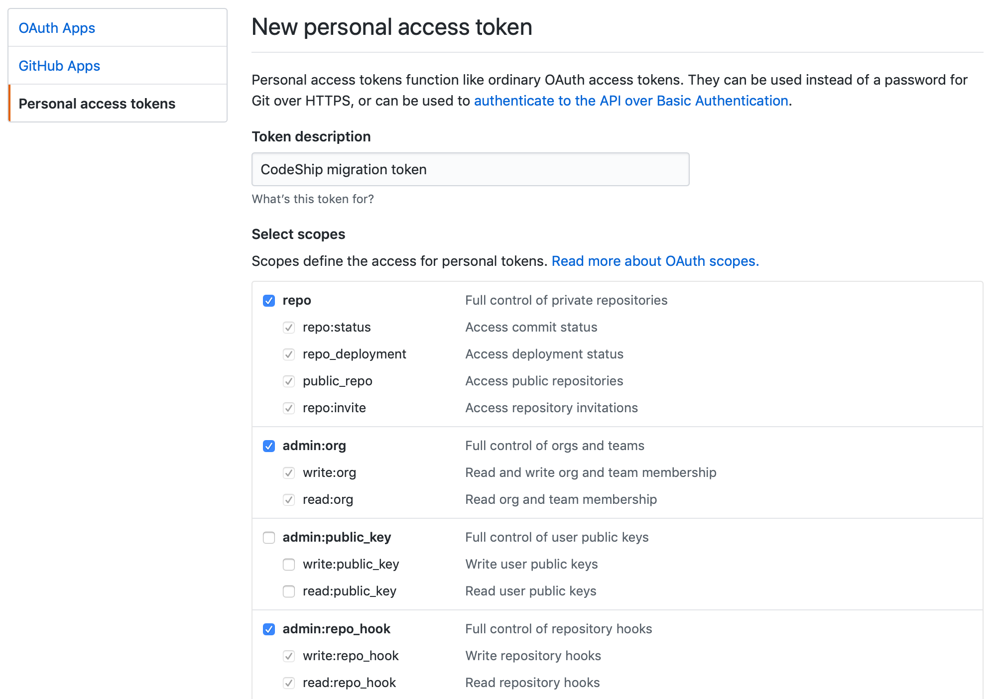
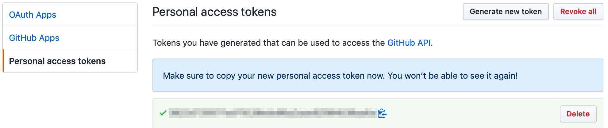

# CodeshipMigrateToGitHubApp

This gem helps you migrate large numbers of projects on CodeShip from using legacy CodeShip GitHub service to the CodeShip GitHub App. For small numbers of projects, the migration wizard on https://codeship.com can help you migrate. However, there is a limit of 100 projects when migrating using the web UI. We've provided this gem to help users with more than 100 projects to migrate all at once.

Unlike the web interface, when using this gem you'll provide an access token to the GitHub API and the migration will be performed on a repository by repository basis on GitHub from your local machine.

### Requirements

To use this gem, you'll need:

- Ruby >= 2.5.0
- CodeShip username and password
- GitHub admin access to repositories

## 1. Install the gem

    gem install codeship_migrate_to_github_app

## 2. Generate a GitHub Personal Access Token

Visit [this](https://github.com/settings/tokens) page to generate a personal access token on GitHub. This token needs to be generated by an owner of the organization containing repositories to be migrated. Make sure your token has the following security scopes:

- repo
- admin:org
- admin:repo_hook

Give your token a descriptive name, click 'Generate token', and you'll be taken to a page displaying your new token. Make a note of this token: it won't be displayed on GitHub again.

## 3. Install the CodeShip GitHub App for a single repository in your GitHub organization

For each GitHub organization containing repositories to migrate, you'll need to install the CodeShip GitHub App and add it to at least one repository.

- Install the CodeShip GitHub App public for your organization by visiting  <https://github.com/apps/codeship/installations/new>
- Select your organization
- Under "Repository Access" select "Only select repositories", and choose at least one repository
- Click save. You'll be redirected back to CodeShip and can safely close the browser window

## 4. Run the migration via gem

    codeship_migrate_to_github_app start --codeship-user=<codeship user email> --codeship-pass=<codeship password> --github-token=<github personal access token>

- codeship-user: your login email address on CodeShip
- codeship-pass: your CodeShip account password
- github-token: the GitHub personal access token generated in step 2

## Getting help

Something not quite right? Reach out to us at <https://helpdesk.codeship.com>

## Contributing

Bug reports and pull requests are welcome on GitHub at https://github.com/codeship/codeship_migrate_to_github_app. This project is intended to be a safe, welcoming space for collaboration, and contributors are expected to adhere to the [Contributor Covenant](http://contributor-covenant.org) code of conduct.

## License

The gem is available as open source under the terms of the [MIT License](https://opensource.org/licenses/MIT).

## Code of Conduct

Everyone interacting in the CodeshipMigrateToGitHubApp project’s codebases, issue trackers, chat rooms and mailing lists is expected to follow the [code of conduct](https://github.com/[USERNAME]/codeship_migrate_to_github_app/blob/master/CODE_OF_CONDUCT.md).
